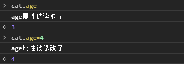
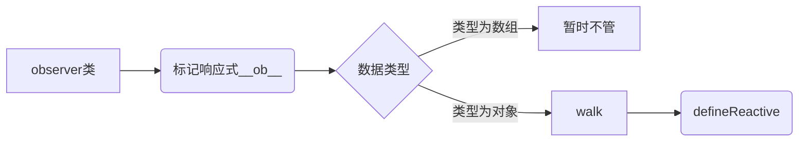

## 介绍

vue 主要是数据驱动试图，UI=render(state)
分为 2 部分，一个是 Object 的侦测变化，二是 Array 的侦测变化
主要是通过`Object.defineProperty`方法实现

## Object 的侦测变化

### 1.可侦测

如何使 Object'可观测'，如下先定义一个数据对象 cat

```js
let cat = {
  age: 3,
};
```

如何用`Object.defineProperty`改变后，检测属性的改变呢，请看下面的例子

```js
let cat = {}
let age = 3
Object.defineProperty(cat,'age',{
  enumerable:true,
  configurable:true,
  get(){
    console.log('age属性被读取了')
    return age
  }
  set(newAge){
    console.log('age属性被修改了')
    age = newAge
  }
})
```

通过`Object.defineProperty()`方法给`cat`定义了一个`age`属性，针对这个属性的读和写分别使用`get()`和`set()`进行了拦截，当该属性被读或者写的时候就会触发`get()`和`set`。如下图：


从图片可以看出，`cat`的属性读写都被监测到了。

怎么把`cat`的所有属性都可监测呢，如下

```js
// 源码位置：src/core/observer/index.js

/* *
*Observer类通过递归把一个对象所有的属性都转化为可观测对象
*/
export class Observer {
  value: any;

  constructor (value: any) {
    this.value = value
    //给value增加一个__ob__属性
    def(value, '__ob__', this)
    if (Array.isArray(value)) {
      //当value为数组时的逻辑
      // ···
    } else {
      this.walk(value)
    }
  }

  /**
   * Walk through all properties and convert them into
   * getter/setters. This method should only be called when
   * value type is Object.
   */
  walk (obj: Object) {
    const keys = Object.keys(obj)
    for (let i = 0; i < keys.length; i++) {
      defineReactive(obj, keys[i])
    }
  }
}

/**
 * 使一个对象转化成可观测对象
 * @param { Object } obj 对象
 * @param { String } key 对象的key
 * @param { Any } val 对象的某个key的值
 */
function defineReactive (
  obj: Object,
  key: string,
  val: any,

) {

  const property = Object.getOwnPropertyDescriptor(obj, key)
  if (property && property.configurable === false) {
    return
  }

  // cater for pre-defined getter/setters
  const getter = property && property.get
  const setter = property && property.set
  //如果参数只有obj和key，那么val=obj[key]
  if ((!getter || setter) && arguments.length === 2) {
    val = obj[key]
  }

  Object.defineProperty(obj, key, {
    enumerable: true,
    configurable: true,
    get: function reactiveGetter () {
    console.log(`${key}`属性被读取了)
      return value
    },
    set: function reactiveSetter (newVal) {
      const value = getter ? getter.call(obj) : val
      if (newVal === value || (newVal !== newVal && value !== value)) {
        return
      }
      console.log(`${key}`属性被修改了)
      if (setter) {
        setter.call(obj, newVal)
      } else {
        val = newVal
      }
    }
  })
}
```

代码运行流程



以上代码使`object`的属性可观测,同时给`value`新增`__ob__`属性，`__ob__`为`value`的`Observer`实例，这样做是为`value`打标记，表示它已经转化为响应式了，避免重复操作。

### 2.依赖收集

#### 2.1 依赖收集的定义

视图的更新逻辑是什么呢？当数据变更时，那个视图用到了这个数据，更新那个视图，而不是更新全部视图。这样性能才是最优的。
换成代码逻辑：每个数据都建立一个依赖数组（一个数据会有多处被使用），视图那个部分依赖了这个数据（用到了这个数据），就将其放入这个数组，当这个数据变化时，找到对应的依赖数组，把每个依赖轮询调用，然后更新相应的视图。这个过程即依赖收集。

#### 2.2 如何进行收集依赖

`Object.defineProperty`中`getter`时收集，`setter`时通知依赖更新

vue 是用了一个依赖管理器`Dep`进行收集

```js
// 源码位置：src/core/observer/dep.js
export default class Dep {
  subs: Array<Watcher>;

  constructor() {
    this.subs = [];
  }

  addSub(sub: Watcher) {
    this.subs.push(sub);
  }

  //删除依赖
  removeSub(sub: Watcher) {
    remove(this.subs, sub);
  }
  //添加依赖
  depend() {
    if (Dep.target) {
      Dep.target.addDep(this);
    }
  }

  //通知依赖更新
  notify() {
    // stabilize the subscriber list first
    const subs = this.subs.slice();

    for (let i = 0, l = subs.length; i < l; i++) {
      subs[i].update();
    }
  }
}
Dep.target = null;
```

上面的管理器`Dep`主要是先初始化一个`subs`数组，然后定义了添加、删除、通知等操作

有了管理器，就可以在`getter`中收集，`setter`中通知更新了

```js{25,27,51}
export function defineReactive(obj: Object, key: string, val: any, customSetter?: ?Function, shallow?: boolean) {
  const dep = new Dep();

  const property = Object.getOwnPropertyDescriptor(obj, key);
  if (property && property.configurable === false) {
    return;
  }

  // cater for pre-defined getter/setters
  const getter = property && property.get;
  const setter = property && property.set;
  if ((!getter || setter) && arguments.length === 2) {
    val = obj[key];
  }

  let childOb = !shallow && observe(val);
  Object.defineProperty(obj, key, {
    enumerable: true,
    configurable: true,
    get: function reactiveGetter() {
      const value = getter ? getter.call(obj) : val;
      if (Dep.target) {
        dep.depend();
        if (childOb) {
          childOb.dep.depend();
          if (Array.isArray(value)) {
            dependArray(value);
          }
        }
      }
      return value;
    },
    set: function reactiveSetter(newVal) {
      const value = getter ? getter.call(obj) : val;
      /* eslint-disable no-self-compare */
      if (newVal === value || (newVal !== newVal && value !== value)) {
        return;
      }
      /* eslint-enable no-self-compare */
      if (process.env.NODE_ENV !== 'production' && customSetter) {
        customSetter();
      }
      // #7981: for accessor properties without setter
      if (getter && !setter) return;
      if (setter) {
        setter.call(obj, newVal);
      } else {
        val = newVal;
      }
      childOb = !shallow && observe(newVal);
      dep.notify();
    },
  });
}
```

如上第 25,27,51 行高亮部分。

### 2.3 依赖的 Watcher

通过上面 2 个章节，我们明白了什么是依赖、何时收集依赖以及收集的依赖放在何处。接下来我们看看收集的这个依赖到底是谁

答案就是`Watcher`类，数据变化后，我们不是直接通知依赖更新，而是通知依赖对应的`Watcher`实例，由`Watcher`实例通知真正的视图去更新。

`Watcher`类的实例如下

```js
// 源码位置：src/core/observer/watcher.js

export default class Watcher {
  vm: Component;
  expression: string;
  cb: Function;
  id: number;
  deep: boolean;
  user: boolean;
  lazy: boolean;
  sync: boolean;
  dirty: boolean;
  active: boolean;
  deps: Array<Dep>;
  newDeps: Array<Dep>;
  depIds: SimpleSet;
  newDepIds: SimpleSet;
  before: ?Function;
  getter: Function;
  value: any;

  constructor(vm: Component, expOrFn: string | Function, cb: Function, options?: ?Object, isRenderWatcher?: boolean) {
    this.vm = vm;

    this.cb = cb;
    this.expression = process.env.NODE_ENV !== 'production' ? expOrFn.toString() : '';
    // parse expression for getter
    if (typeof expOrFn === 'function') {
      this.getter = expOrFn;
    } else {
      this.getter = parsePath(expOrFn);
      if (!this.getter) {
        this.getter = noop;
        process.env.NODE_ENV !== 'production' &&
          warn(
            `Failed watching path: "${expOrFn}" ` +
              'Watcher only accepts simple dot-delimited paths. ' +
              'For full control, use a function instead.',
            vm,
          );
      }
    }
  }

  /**
   * Evaluate the getter, and re-collect dependencies.
   */
  get() {
    pushTarget(this);
    let value;
    const vm = this.vm;
    try {
      value = this.getter.call(vm, vm);
    } catch (e) {
      if (this.user) {
        handleError(e, vm, `getter for watcher "${this.expression}"`);
      } else {
        throw e;
      }
    } finally {
      // "touch" every property so they are all tracked as
      // dependencies for deep watching
      if (this.deep) {
        traverse(value);
      }
      popTarget();
      this.cleanupDeps();
    }
    return value;
  }

  /**
   * Subscriber interface.
   * Will be called when a dependency changes.
   */
  update() {
    /* istanbul ignore else */
    if (this.lazy) {
      this.dirty = true;
    } else if (this.sync) {
      this.run();
    } else {
      queueWatcher(this);
    }
  }
}
```

## Array 的侦测变化
